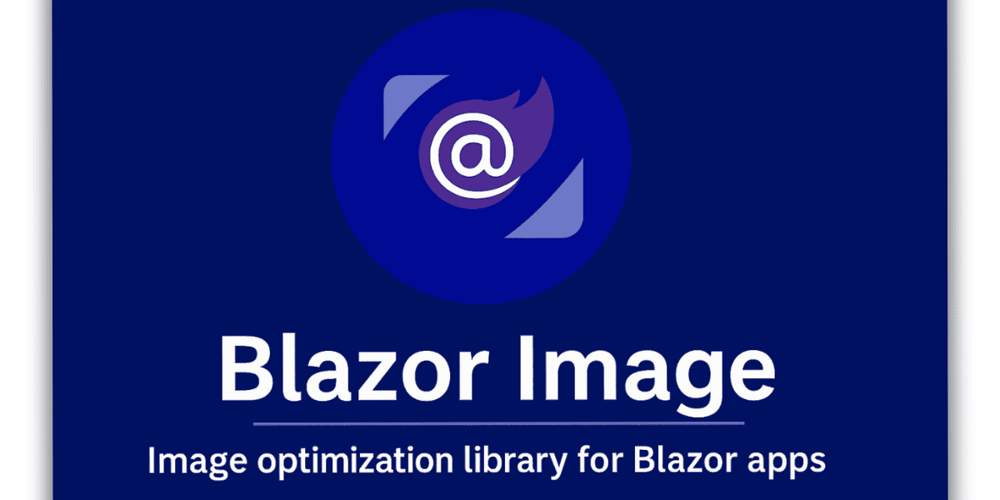

# 

[](https://www.nuget.org/packages/BlazorImage/)
[](https://www.nuget.org/packages/BlazorImage)

## BlazorImage – Image Optimization for Blazor (.NET)
**BlazorImage** is a powerful image optimization library for [Blazor](https://dotnet.microsoft.com/en-us/apps/aspnet/web-apps/blazor) that automates compression, responsive sizing, and caching of static images (`.jpg`, `.png`, `.webp`, `.avif`)—all in one component.


Easily deliver optimized images with a single line:

```razor
<Image Src="/images/sample.jpg" Alt="Descriptive alt text" Width="300" Height="200" />
```

## Features

- **Optimized Images:** Compress JPEG, PNG, WebP, and AVIF formats with 70–90% size reduction.
- **Lazy Loading & Placeholders:** Improve performance and perceived loading speed with lightweight placeholders.
- **Flexible Output Formats:** Choose from WebP, JPEG, PNG, or AVIF to suit your needs.
- **Smart Caching & Revalidation:** Efficient long-term caching with automatic revalidation—ensures images stay fresh without repeated processing.
- **Responsive & Adaptive Support:** Define responsive sizes and aspect ratios for modern layouts.
- **Accessibility & SEO Friendly:** Fully supports `alt` text, captions, and semantic markup.
- **Interactive State Management:** Enable interaction-aware behavior via `EnableInteractiveState`.

    ... and more

## Getting Started

### ✅ Requirements

- [.NET 9.0 SDK](https://dotnet.microsoft.com/en-us/download) or later
- Blazor Server App (Blazor WebAssembly is **not yet supported**)

> ✅ *Currently supports local images only. Remote image support is coming soon.*

---

### 📦 Installation

**Using .NET CLI:**

```bash
dotnet add package BlazorImage --version 1.0.4
```

**Or add a reference manually:**
```bash
<PackageReference Include="BlazorImage" Version="1.0.4" />
```


### 🧩 Setup

In **_Imports.razor**:

```csharp
@using BlazorImage
```

In **Program.cs**:

```csharp
builder.Services.AddBlazorImage();
```
You can further configure BlazorImage with the following options within the AddBlazorImage method:
```csharp
builder.Services.AddBlazorImage(options =>
{
    // Output directory for optimized images (relative to wwwroot). Default: "_optimized"
    options.OutputDir = "Path";

    // Responsive widths for generated image variants.
    // Recommended: [xs, sm, md, lg, xl, 2xl, ...] to cover common breakpoints.
    // Default: [480, 640, 768, 1024, 1280, 1536]
    options.Sizes = [640, 1024, 1280];

    // Default image quality (15–100). Lower means more compression.
    // Default: 75 | Recommended: 70–80 (Good balance of quality and file size)
    options.DefaultQuality = 70;

    // Default image output format (jpeg, png, webp, avif).
    // Default: webp | Recommended: FileFormat.webp (widely supported and efficient)
    options.DefaultFileFormat = FileFormat.webp;
});

```

Map required middleware in **Program.cs**:

```csharp
app.MapBlazorImageRuntime();
```

example to use:
```csharp
// 👇 Add this line to serve optimized images
app.MapBlazorImageRuntime();
app.MapStaticAssets(); // For .NET 9
```

Include required assets in **App.razor**:

CSS:

```html
<link rel="stylesheet" href="@Assets["AssemblyName.styles.css"]" />
```

 JS:
 ```html
<script src="_content/BlazorImage/BlazorImage.min.js"></script>
```

 
### Dashboard Endpoint

Expose the image cache management UI:

Enable with:

```csharp
app.MapBlazorImageDashboard("/endpoints/path");
```
 
## `<Image>` Component

Use the `<Image>` component to render optimized, responsive, and accessible images:

```razor
<Image Src="/images/sample.jpg" Alt="Descriptive alt text" Width="300" Height="200" />
```
### `<Image>` Component Parameters

> **Note:** Use `CssClass` instead of `class`, and `Style` instead of `style` for all styling.

- **`Src`** (required):  
  The path to the original image file. BlazorImage will handle the optimization.

- **`Alt`** (required):  
  Alternative text for the image, crucial for accessibility and SEO.

- **`Fill`** (optional, `bool`):  
  If `true`, the image fills its container while maintaining aspect ratio. Defaults to `false`.

- **`Width`, `Height`** (optional, `int?`):  
  Set fixed image dimensions in pixels.

- **`Priority`** (optional, `bool`):  
  If `true`, the image loads eagerly. Defaults to `false`.

- **`DefaultSrc`** (optional, `string`):  
  Fallback image to override the error messages.

- **`Quality`** (optional, `int?`):  
  Sets optimized image quality (15–100). Defaults to library setting.

- **`Format`** (optional, `FileFormat?`):  
  Desired image output format (`webp`, `jpeg`, `png`, `avif`, etc.).  
  _Note: AVIF may require extra build steps in some environments._

- **`Sizes`** (optional, `string`):  
  Sets the `sizes` attribute for responsive behavior.

- **`CssClass`** (optional, `string`):  
  CSS classes to apply to the `` tag.  
  _Use this instead of `class`._

- **`Style`** (optional, `string`):  
  Inline styles for the `` tag.  
  _Use this instead of `style`._

- **`Caption`** (optional, `string`):  
  Text to display below the image.

- **`CaptionClass`** (optional, `string`):  
  CSS class for styling the caption.

- **`AspectRatio`** (optional, `(int, int)`):  
  Used when `Fill="true"` to preserve image ratio.

- **`EnableDeveloperMode`** (optional, `bool`):  
  Shows extra debugging info (developer panel).

- **`EnableInteractiveState`** (optional, `bool`):  
  Enables state interactivity for the image (e.g., loading, error state handling).

- **`Id`** (optional, `string`):  
  Custom ID for the image element. Used internally or for anchoring, preload.

- **`AdditionalAttributes`** (optional):  
  Add any additional HTML attributes via a `Dictionary<string, object>`.  
  These are applied directly to the `` element.

---

### 📘 Usage Examples

**Responsive with fill:**

```razor
<div style="width: 400px; height: 400px;">
    <Image Src="/images/banner.jpg" Alt="Banner" Fill="true" />
</div>
```

**Static dimensions:**

```razor
<Image Src="/images/logo.png" Alt="Logo" Width="100" Height="100" />
```

**Eager loading (hero image):**

```razor
<Image Src="/images/hero.jpg" Alt="Hero image" Priority="true" />
```

**Custom format + quality:**

```razor
<Image Src="/images/preview.png" Alt="Preview" Format="FileFormat.png" Quality="85" />
```

**Sizes Attribute:**

```razor
 <Image Src="/images/avatar.jpg" Alt="Avatar image" Sizes="(max-width: 768px) 8rem, 13rem" CssClass="rounded-full object-cover"  Fill="true" Priority="true" />
```

**Adding a caption:**

```razor
<Image Src="/images/product.jpg" Alt="Product shot" Caption="The latest product" CaptionClass="product-caption" />
```

**Using a default image:**
```razor
<Image Src="/images/non-existent.jpg" Alt="Fallback image" DefaultSrc="/images/default.jpg" />
```

##  License
This project is licensed under the MIT License. See the [LICENSE](LICENSE.txt) for full details.

## Keywords

`blazor image optimization`, `blazor responsive images`, `blazor webp`, `dotnet image compression`, `blazor image component`, `blazor image resizing`, `static image optimization`, `blazor lazy loading images`, `blazor avif`, `aspnet image optimization`, `razor image library`
